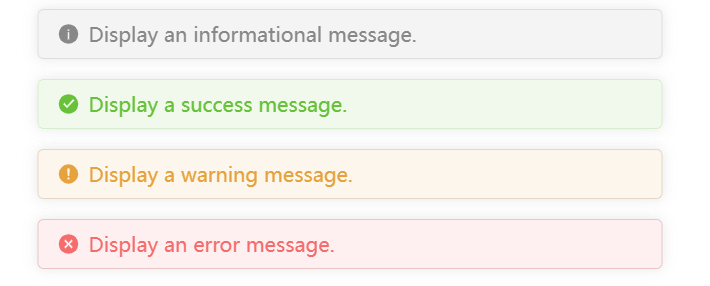

# message.js

Web-based global notification.



## Installation

```bash
npm install message.js
```

```bash
yarn add message.js
```

## Usage

```js
// Import
import message from 'message';

// Call
message.info('Display an informational message.');
message.success('Display a success message.');
message.warning('Display a warning message.');
message.error('Display an error message.');
```
